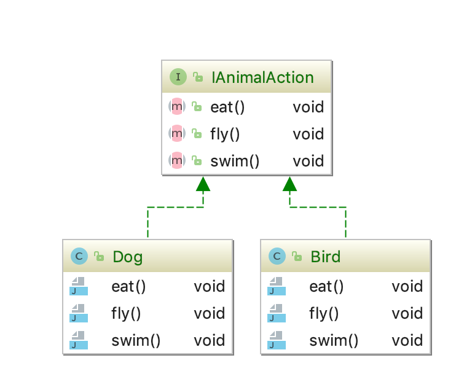
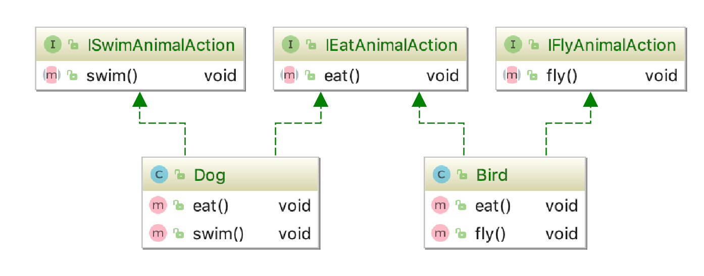

## 接口隔离原则

### 概念

* 用多个专门的接口，而不使用单一的总的接口，客户端不应该依赖它不需要的接口。

* 一个类对一个类的依赖应该建立在最小的接口上；

* 建立单一，不要庞大臃肿的接口；

* 尽量细化接口，接口中的方法尽量少；

### 优缺点

* 符合高内聚低耦合的设计思想，从而使得类有很好的可读性、可扩张性和可维护性；

> 使用该原则一定要注意适度，如果过小容易造成接口太多，增加程序复杂度，如果太少又会导致冗余；

### 举例

* 如下，IAnimalAction 声明的方法过多，造成实现类中用使用到的方法是空实现，比如dog不能飞，大多数bird不能游泳。

* 重写,为每一个功能做一个接口，在实现类的时候可以随意组合实现，没有空实现；

### [详细代码](https://github.com/qiujiahong/design-pattern/tree/master/src/main/java/com/nick/design/principle/interfacesegregation)