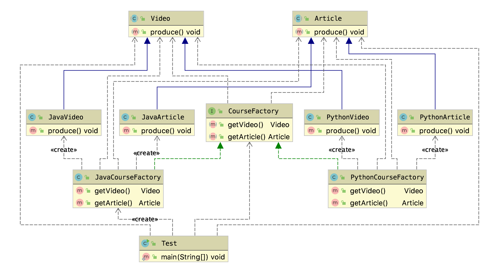
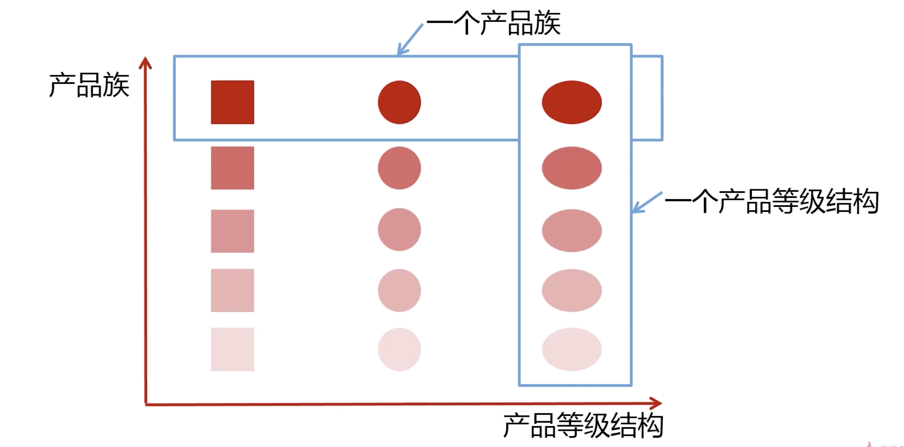

# 抽象工程模式

## 定义

抽象工厂模式提供一个创建一系列相关或者相互依赖对象的接口。  

无需指定他们具体的类；

抽象工厂针对产品族。

## 适用场景 

* 客户端（应用层）不依赖于产品类实例如何被创建、实现等细节；
* 强调一系列相关的产品对象（属于同一产品族）一起使用创建对象需要大量重复代码；
* 提供了一个产品类的库，所有的产品以同样的接口出现，从而使客户端不依赖于具体实现；


## 优点

* 具体产品在应用层隔离，无需关心创建细节；
* 将一个系列的产品族统一到一起创建

## 缺点

* 规定了所有可能的被创建的产品集合，产品族中扩展新产品困难,需要修改抽象工厂的接口；
* 增加类系统的复杂性和理解难度；


## 类图



* 声明多个抽象产品；（对应 Video  和 Article ）
* 声明一个抽象工厂方法: CourseFactory
* 增加对应产品实现 (JavaArticle 和 JavaVideo)
* 增加对应工厂实现 JavaCourseFactory
* 应用层调用  

```JAVA
public class Test {
    public static void main(String[] args) {
        CourseFactory courseFactory = new JavaCourseFactory();
        Video video = courseFactory.getVideo();
        Article article = courseFactory.getArticle();
        video.produce();
        article.produce();
    }
}

```


## [详细代码](../src/main/java/com/nick/design/pattern/creational/abstractfactory)


## 补充说明，产品等级结构和产品族




* 如上图相同颜色（品牌）的叫一个产品。（同一个工厂生产）
* 相同形状的叫产品等级；

