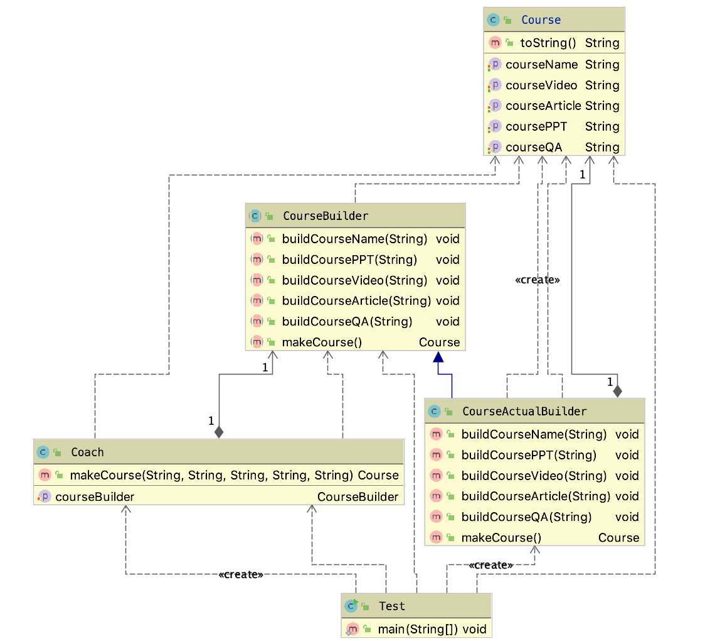

# 建造者模式

## 定义

将一个复杂对象的构建与它的表示分离，似的同样的构建过程可以创建不同的表示。

用户只需要指定建造的类型就可以得到它们，建造的细节不需要知道。

创建型

## 适用场景

* 如果一个对象有非常复杂的内部结构（非常多的属性）
* 想把复杂的对象的的创建和使用分离；

## 优点

* 封装性好，创建和使用隔离；
* 扩展性好，建造类之间独立、一定程度上解耦；

## 缺点

* 产生多余的builder对象
* 产品内部发生变化、建造者也需要修改，成本较大；

## 类图

> 当创建一个对象需要很多步骤时需要使用建造者模式；如果仅仅是需要一个简单的方法创建一个简单的对象则使用工厂模式；

