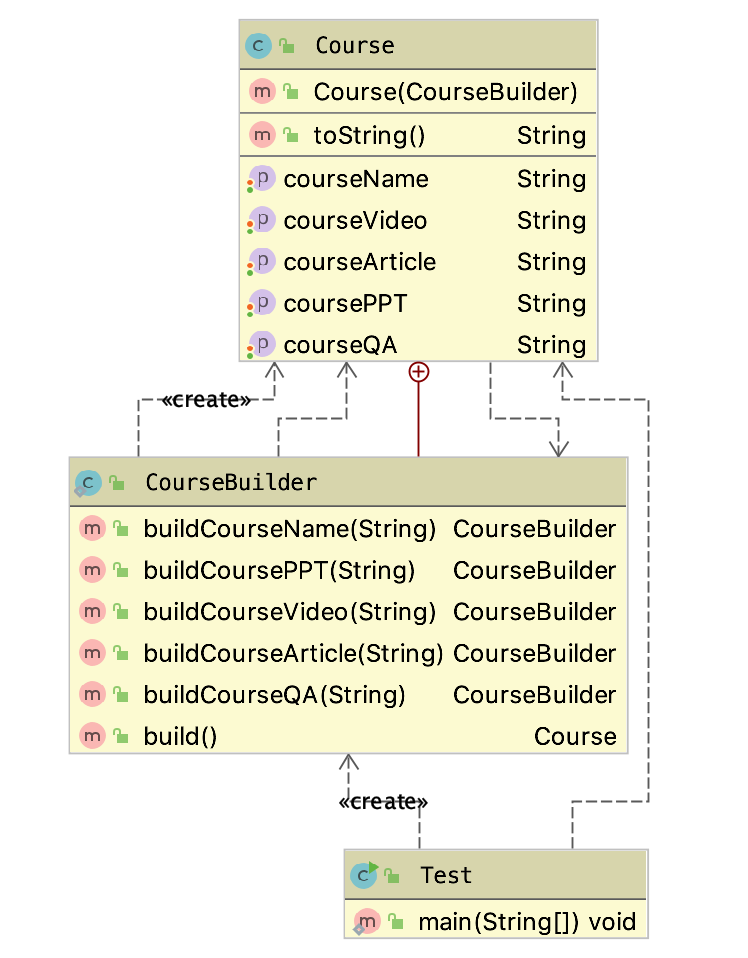

# 建造者模式-改进

本文使用链式调用改进建造者模式。


## 类图




## 代码

*  Course.java

```
@Data
public class Course {
    private String courseName;
    private String coursePPT;
    private String courseVideo;
    private String courseArticle;

    private String courseQA;

    public Course(CourseBuilder courseBuilder) {
        this.courseName = courseBuilder.courseName;
        this.coursePPT = courseBuilder.coursePPT;
        this.courseQA = courseBuilder.courseQA;
        this.courseArticle = courseBuilder.courseArticle;
        this.courseVideo = courseBuilder.courseVideo;

    }

    public static class CourseBuilder {

        private String courseName;
        private String coursePPT;
        private String courseVideo;
        private String courseArticle;

        private String courseQA;

        public CourseBuilder buildCourseName(String courseName){
            this.courseName = courseName;
            return this;
        }

        public CourseBuilder buildCoursePPT(String coursePPT) {
            this.coursePPT = coursePPT;
            return this;
        }

        public CourseBuilder buildCourseVideo(String courseVideo) {
            this.courseVideo = courseVideo;
            return this;
        }

        public CourseBuilder buildCourseArticle(String courseArticle) {
            this.courseArticle = courseArticle;
            return this;
        }

        public CourseBuilder buildCourseQA(String courseQA) {
            this.courseQA = courseQA;
            return this;
        }

        public Course build(){
            return new Course(this);
        }
    }

    @Override
    public String toString() {
        return "Course{" +
                "courseName='" + courseName + '\'' +
                ", coursePPT='" + coursePPT + '\'' +
                ", courseVideo='" + courseVideo + '\'' +
                ", courseArticle='" + courseArticle + '\'' +
                ", courseQA='" + courseQA + '\'' +
                '}';
    }
}

```


* 应用 Test.java

```
public class Test {
    public static void main(String[] args) {
        Course  course = new Course.CourseBuilder()
                    .buildCourseName("java设计模式")
                .buildCourseArticle("java设计模式手记")
                .buildCoursePPT("java设计模式ppt")
                .buildCourseVideo("java设计模式video")
                .buildCourseQA("java设计模式qa")
                .build();
        System.out.println(course);
    }
}

```