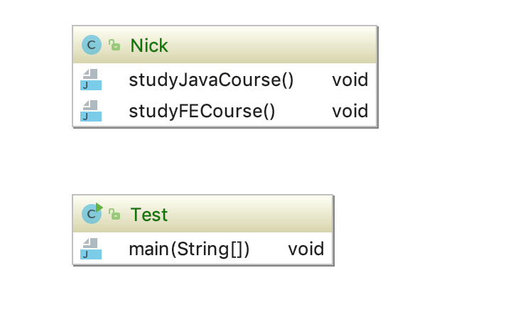
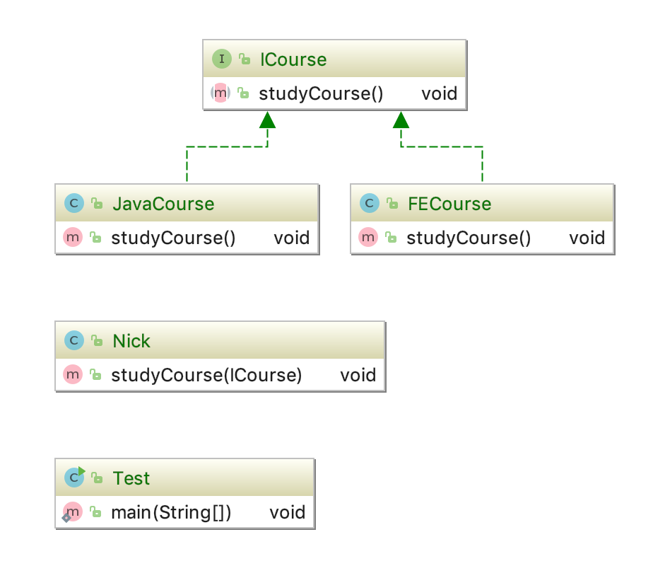

## 依赖倒置原则

### 概念

* 高层模块不应该依赖底层模块，二者都应该依赖其抽象；
* 抽象不应该依赖细节，细节应该依赖抽象；
* 针对接口编程，不要针对实现编程；

### 优点

减少系统的耦合性、提高系统稳定性，提高代码可读性和可维护性，可降低修改程序所造成的风险；


### 举例

* 改进前  



```java
public class Test {
    public static void main(String[] args) {
        Nick nick = new Nick();
        nick.studyJavaCourse();
        nick.studyFECourse();
    }
}
```

* 改进后



```java
public class Test {
    public static void main(String[] args) {
        Nick nick = new Nick();
        nick.studyCourse(new JavaCourse());
        nick.studyCourse(new FECourse());
    }
}
```

如上所示，高层模块Test类，在改进后的代码中不再依赖于Nick类，如果要添加新的课程只需要心添加一个集成ICourse的类即可，完全不修改之前的代码。

