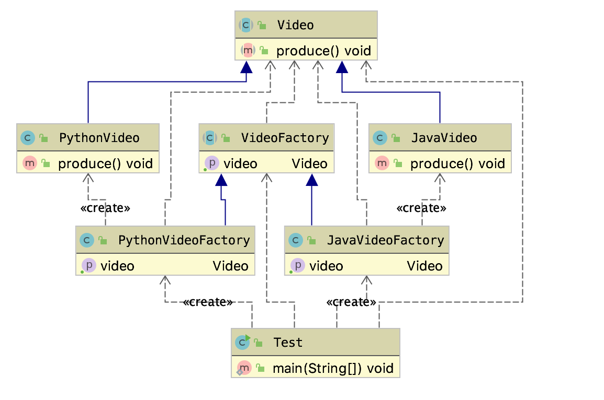

# 工厂方法模式

## 定义

定义一个创建对象的接口，但让实现这个接口的类来决定实例化哪一个类，工厂方法让类的实例化推迟到子类中去执行。

## 适用场景

* 创建对象需要大量重复代码
* 客户端（应用层）不依赖于产品类实例如何被创建、实现等细节；
* 一个类通过其子类来指定创建哪个对象；

## 优点

* 用户只需要关心所需产品对应的工厂，无需关心创建细节；
* 加入新产品符合开闭原则，提高可扩展性； 

## 缺点

* 类的个数过多增加复杂度；
* 增加系统的抽象性和理解难度；

## 类图

* 如上图video是产品的抽象，JavaVideo和PythonVideo是具体的产品
* VideoFactory是工厂的抽象，JavaVideoFactory和PythonVideoFactory是工厂的具体实现；
* 如果需要加一个算法视频，则添加一个实体类，再添加一个工厂类即可。

## [详细代码](../src/main/java/com/nick/design/pattern/creational/factorymethod)

1