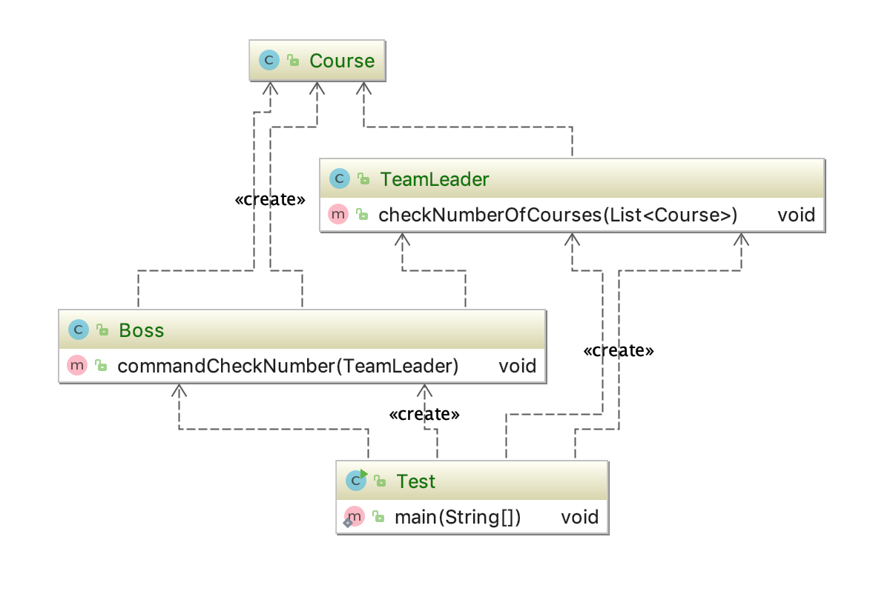
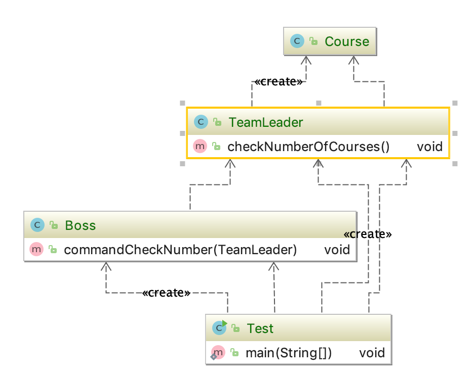

## 迪米特原则

### 概念

* 最少知道原则，一个对象应该对其他对象保持最少的了解；

* 尽量降低类与类的耦合；

* 强调只和朋友交流不和陌生人说话；

> 朋友：出现在成员变量，方法输入、输出参数中的类称为朋友类，而出现在在方法体内部的类不是朋友类；

对外部引入的类越少越好；


### 优缺点

降低代码之间的耦合

如果过份的使用该原则，会导致产生大量的中介类使系统变复杂；


### 举例

* 下面类，Course是Boss类方法体中的类（不是朋友），增加了不必要的依赖；

```java
public class Boss {
    public void commandCheckNumber(TeamLeader teamLeader){
        List<Course> courses = new ArrayList<Course>();
        for (int i=0;i<20;i++){
            courses.add(new Course());
        }
        teamLeader.checkNumberOfCourses(courses);
    }
}
```

```java
public class TeamLeader {
    public void checkNumberOfCourses(List<Course> courses){
        System.out.println("课程数量是:"+courses.size());
    }
}
```

```java
public class Course {
}
```





* 改进，boss直接给TeamLeader 直接返回结果,改变之后Boss和Course不再直接接触；

```java

public class Boss {
    public void commandCheckNumber(TeamLeader teamLeader){
        teamLeader.checkNumberOfCourses();
    }
}
```

```java
public class TeamLeader {
    public void checkNumberOfCourses(){
        List<Course> courses = new ArrayList<Course>();
        for (int i=0;i<20;i++){
            courses.add(new Course());
        }
        System.out.println("课程数量是:"+courses.size());
    }
}
```

