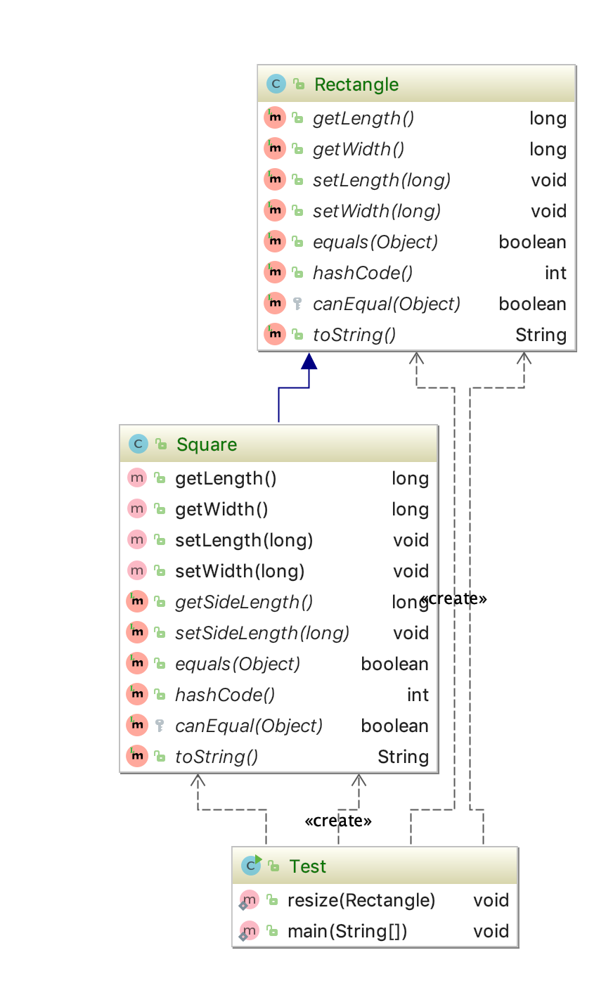
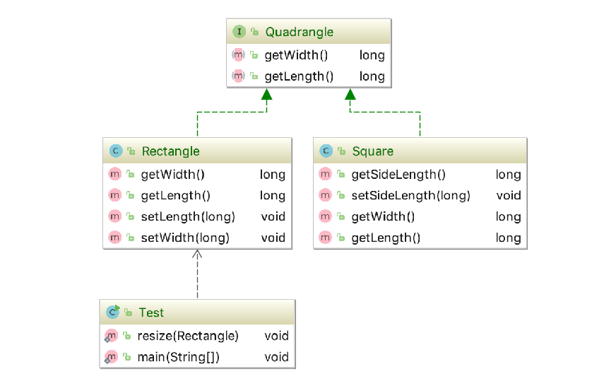

## 里氏替换原则

### 概念

* 如果对于每一个类型为T1的对象o1,都有类型为T2的对象o2，使得以为T1定义的所有程序P在所有对象o1替换成为o2时，程序p的行为没有发生变化，那么t2是类型t1的子类型；


* 一个软件实体如果适用一个父类的华，那一定适用其子类，所有引用父类对象的地方必须能够透明的使用其子类的对象，子类对象能够替换父类对象，而程序的逻辑不变；


> 反对子类重写父类的方法；重写方法为程序带来了便利，但是同时也为重新父类的时候对子类的影响带来了风险；

* 子类可以扩展父类的功能，但是不能修改父类的原有功能；

* 子类可以实现父类的抽象方法，但是不能覆盖父类的方法；

* 子类可以增加自己特有的方法；

* 当子类的方法重载父类的方法时，方法的前置条件要比父类方法的输入参数更宽松；

* 当子类的方法实现父类方法时（重写/重载或者实现抽象方法）方法的后置条件（既方法的输出，返回值）要比父类更严格；


### 优缺点

* 约束集成泛滥，开闭原则体现；
* 加强程序的健壮性，同时变更时也可以做到非常好的兼容性，提高程序的可维护性、扩展性。降低需求变更的风险。


### 代码

* 正方形即成长方形，但是执行效果却不一样




* 添加一个Quadrangle 类，正方形、长方形，都继承四边形类，这个时候resize不能直接使用Quadrangle类作为传入参数，因为该类不具备setWidth方法，从而避免违背里氏替换原则代码；




* 输入(函数参数)子类比父类宽松；

```java
public class Base {
    public void method(HashMap map){
        System.out.println("父类被执行");
    }
}
```

```java
public class Child extends Base {
    //重写
//    @Override
//    public void method(HashMap map) {
//        System.out.println("子类HashMap被执行");
////        super.method(map);
//    }
    //重载  子类的需要更宽松'
    public void method(Map map) {
        System.out.println("子类map被执行");
//        super.method(map);
    }
}
```

```java

public class Test {
    public static void main(String[] args) {
        Child child = new Child();
        HashMap hashMap = new HashMap();
        child.method(hashMap);
    }
}
```

* 输出(函数返回值)子类比父类更严格，这个一般idea会报错；


### [完整代码](https://github.com/qiujiahong/design-pattern/tree/master/src/main/java/com/nick/design/principle/liskovsubstitution)