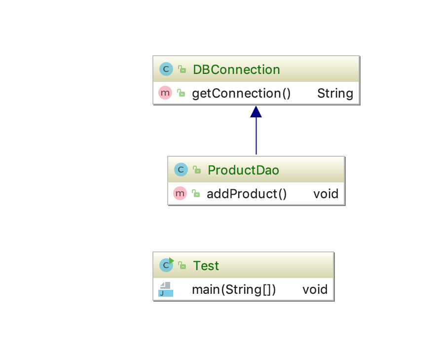
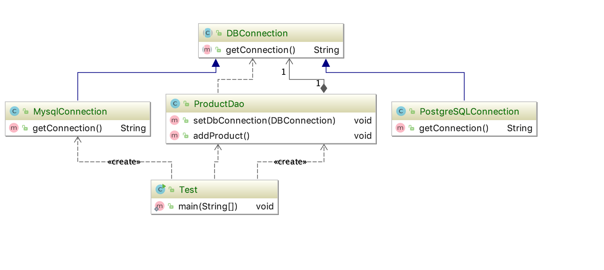

## 合成/聚合复用原则

### 定义

* 尽量使用对象组合/聚合，而不使用集成关系达到软件复用的目的

* 聚合 has a ，组合 contains a 

### 优缺点

可以使系统框架灵活，降低类与类之间的耦合度，一个类的变化对其他类造成的影响相对较少。

通过这种方式建造的系统会有较多的对象需要管理；

> 继承复用，白箱复用，子类可以看到父类的东西；
> 聚合，组合复用，黑箱复用，a类包含一个b类，对于b的具体实现a类是不知道的；

### 代码

* 改进前代码，通过继承复用

* 改进一个抽象类获取接口，2个具体的数据库链接类获取数据库链接，dao层使用set方法注入具体的链接；

